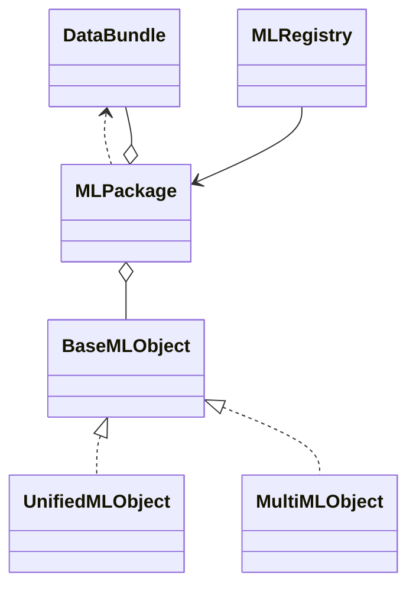

# ML Core Quick Start

このパッケージは、データ・モデル・メタ情報をひとかたまりとして管理する仕組みを提供します。

```python
from pathlib import Path
from ml_core.data_bundle import DataBundle
from ml_core.unified_mlobject import UnifiedMLObject
from ml_core.ml_package import MLPackage

# DataFrame は MultiIndex(['Date', 'Sector']) を想定
bundle = DataBundle(features_df, targets_df, order_price_df)
ml = UnifiedMLObject()
package = MLPackage(ml, bundle)
package.train()
pred_df = package.predict()
package.save(Path('saved_model'))

loaded = MLPackage.load(Path('saved_model'))
loaded.predict()
```



